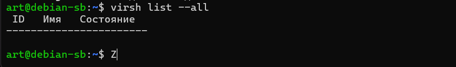
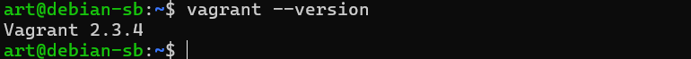
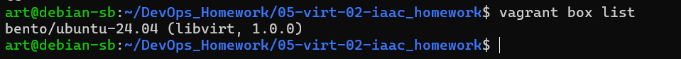

# Задача 1
Установите на личный Linux-компьютер или учебную локальную ВМ с Linux следующие сервисы(желательно ОС ubuntu 20.04):

VirtualBox,
Vagrant, рекомендуем версию 2.3.4
Packer версии 1.9.х + плагин от Яндекс Облако по инструкции
уandex cloud cli Так же инициализируйте профиль с помощью yc init .
Примечание: Облачная ВМ с Linux в данной задаче не подойдёт из-за ограничений облачного провайдера. У вас просто не установится virtualbox.

## Решение
 1. Обновление системы и установка VirtualBox:

 ```
sudo apt update && sudo apt upgrade -y
sudo apt install -y virtualbox virtualbox-ext-pack
```
Если не ставит
```
# Добавление ключа репозитория
wget -q https://www.virtualbox.org/download/oracle_vbox_2016.asc -O- | sudo apt-key add -
wget -q https://www.virtualbox.org/download/oracle_vbox.asc -O- | sudo apt-key add -

# Добавление репозитория в sources.list
echo "deb [arch=amd64] https://download.virtualbox.org/virtualbox/debian $(lsb_release -sc) contrib" | sudo tee /etc/apt/sources.list.d/virtualbox.list

# Обновление списка пакетов
sudo apt update

# Установка VirtualBox
sudo apt install -y virtualbox-7.0  # или другая версия
```

### Виртуалка не запустилась 
выдала ошибку 
```
Virtualized AMD-V/RVI is not supported on this platform.
Continue without virtualized AMD-V/RVI?
```


### ✅ Альтернатива 1: libvirt + QEMU/KVM (рекомендуется для Linux)
Это нативный гипервизор Linux, более производительный и современный, чем VirtualBox.

```
# 1. Установите необходимые пакеты
sudo apt update
sudo apt install -y qemu-kvm libvirt-daemon-system libvirt-clients bridge-utils virt-manager

# 2. Добавьте пользователя в нужные группы
sudo adduser $USER libvirt
sudo adduser $USER kvm

# 3. Перезайдите в систему или выполните:
newgrp libvirt

# 4. Установите плагин Vagrant для libvirt
vagrant plugin install vagrant-libvirt

# 5. Проверьте установку
virsh list --all  # Должен показать пустой список ВМ
```



### Ставим Vagrand

```
sudo apt update
sudo apt install vagrant
```


### Создаем Vagrand файл
```
export VAGRANT_SERVER_URL='https://vagrant.elab.pro'
```
```
Vagrant.configure("2") do |config|
# ENV['VAGRANT_SERVER_URL'] = 'https://vagrant.elab.pro'
  config.vm.box = "bento/ubuntu-24.04"
  config.vm.provider "libvirt" do |lv|
    lv.memory = 1024
    lv.cpus = 1
  end
end
```
качаем 
```
vagrant box add bento/ubuntu-24.04
```
```
vagrant box list
```
