# Задача 1
Установите на личный Linux-компьютер или учебную локальную ВМ с Linux следующие сервисы(желательно ОС ubuntu 20.04):

VirtualBox,
Vagrant, рекомендуем версию 2.3.4
Packer версии 1.9.х + плагин от Яндекс Облако по инструкции
уandex cloud cli Так же инициализируйте профиль с помощью yc init .
Примечание: Облачная ВМ с Linux в данной задаче не подойдёт из-за ограничений облачного провайдера. У вас просто не установится virtualbox.

## Решение
 1. Обновление системы и установка VirtualBox:

 ```
sudo apt update && sudo apt upgrade -y
sudo apt install -y virtualbox virtualbox-ext-pack
```
Если не ставит
```
# Добавление ключа репозитория
wget -q https://www.virtualbox.org/download/oracle_vbox_2016.asc -O- | sudo apt-key add -
wget -q https://www.virtualbox.org/download/oracle_vbox.asc -O- | sudo apt-key add -

# Добавление репозитория в sources.list
echo "deb [arch=amd64] https://download.virtualbox.org/virtualbox/debian $(lsb_release -sc) contrib" | sudo tee /etc/apt/sources.list.d/virtualbox.list

# Обновление списка пакетов
sudo apt update

# Установка VirtualBox
sudo apt install -y virtualbox-7.0  # или другая версия
```
### вариант 2
```
# Скачивание и добавление ключей
curl -L http://download.virtualbox.org/virtualbox/debian/oracle_vbox_2016.asc -o oracle_vbox_2016.asc && sudo gpg --dearmor --yes -o /etc/apt/trusted.gpg.d/oracle_vbox_2016.gpg oracle_vbox_2016.asc
curl -L http://download.virtualbox.org/virtualbox/debian/oracle_vbox.asc -o oracle_vbox.asc && sudo gpg --dearmor --yes -o /etc/apt/trusted.gpg.d/oracle_vbox.gpg oracle_vbox.asc

# Добавление репозитория
echo "deb [arch=amd64 signed-by=/etc/apt/trusted.gpg.d/oracle_vbox_2016.gpg] https://download.virtualbox.org/virtualbox/debian $(lsb_release -sc) contrib" | sudo tee /etc/apt/sources.list.d/virtualbox.list

# Обновление пакетов и установка VirtualBox
sudo apt update && sudo apt install -y virtualbox-7.0
```


### Виртуалка не запустилась 
выдала ошибку 
```
Virtualized AMD-V/RVI is not supported on this platform.
Continue without virtualized AMD-V/RVI?
```


### ✅ Альтернатива 1: libvirt + QEMU/KVM (рекомендуется для Linux)
Это нативный гипервизор Linux, более производительный и современный, чем VirtualBox.

```
# 1. Установите необходимые пакеты
sudo apt update
sudo apt install -y qemu-kvm libvirt-daemon-system libvirt-clients bridge-utils virt-manager

# 2. Добавьте пользователя в нужные группы
sudo adduser $USER libvirt
sudo adduser $USER kvm

# 3. Перезайдите в систему или выполните:
newgrp libvirt

# 4. Установите плагин Vagrant для libvirt
vagrant plugin install vagrant-libvirt

# 5. Проверьте установку
virsh list --all  # Должен показать пустой список ВМ
```

--------------------------------------------------------------------------------

## Ставим Vagrand

```
sudo apt update
sudo apt install vagrant
vagrant --version

```


```
export VAGRANT_DEFAULT_PROVIDER=virtualbox

```
### Создаем Vagrand файл
```
export VAGRANT_SERVER_URL='https://vagrant.elab.pro'
```
скачиваем образ 
```
vagrant box add bento/ubuntu-24.04 --provider=virtualbox --force
```
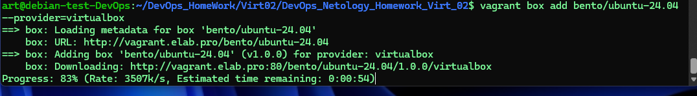

```
vagrant box list
```

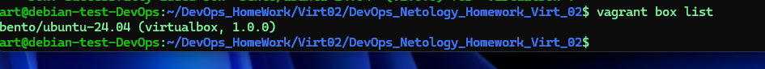

Создаем файл Vagrand

```
ISO = "bento/ubuntu-24.04"
NET = "192.168.192."
DOMAIN = ".netology"
HOST_PREFIX = "server"
INVENTORY_PATH = "../ansible/inventory"

servers = [
  {
    :hostname => HOST_PREFIX + "1" + DOMAIN,
    :ip => NET + "11",
    :ssh_host => 20011,
    :ssh_vm => 22,
    :ram => 1024,
    :core => 1
  }
]

Vagrant.configure("2") do |config|
  config.vm.synced_folder ".", "/vagrant", disabled: false

  servers.each do |machine|
    config.vm.define machine[:hostname] do |node|
      node.vm.box = ISO
      node.vm.hostname = machine[:hostname]
      node.vm.network "private_network", ip: machine[:ip]
      node.vm.network :forwarded_port,
                      guest: machine[:ssh_vm],
                      host: machine[:ssh_host]

      node.vm.provider "virtualbox" do |vb|
        vb.customize ["modifyvm", :id, "--memory", machine[:ram]]
        vb.customize ["modifyvm", :id, "--cpus", machine[:core]]
        vb.name = machine[:hostname]
      end
    end
  end
end


#ENV['VAGRANT_SERVER_URL'] = 'http://vagrant.elab.pro'
#Vagrant.configure("2") do |config|
#  config.vm.box = "bento/ubuntu-24.04"
#  config.vm.provider "libvirt" do |lv|
#    lv.memory = 1024
#    lv.cpus = 1
#    lv.driver = "qemu"
#    lv.cpu_model = "qemu64"
#    lv.machine_type = "pc"
#  end
#end

```
Проверяем, если все ок запускаем
```
vagrant validate
vagrant up
```
Получили ошибку 
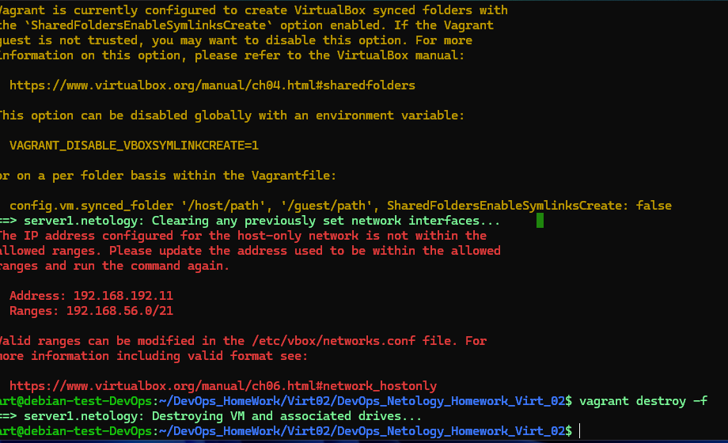
```
vagrant destroy
```
Поменяем NET = "192.168.192." --> NET = "192.168.56." в файле 

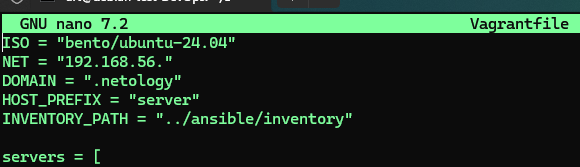
```
vagrant up
```
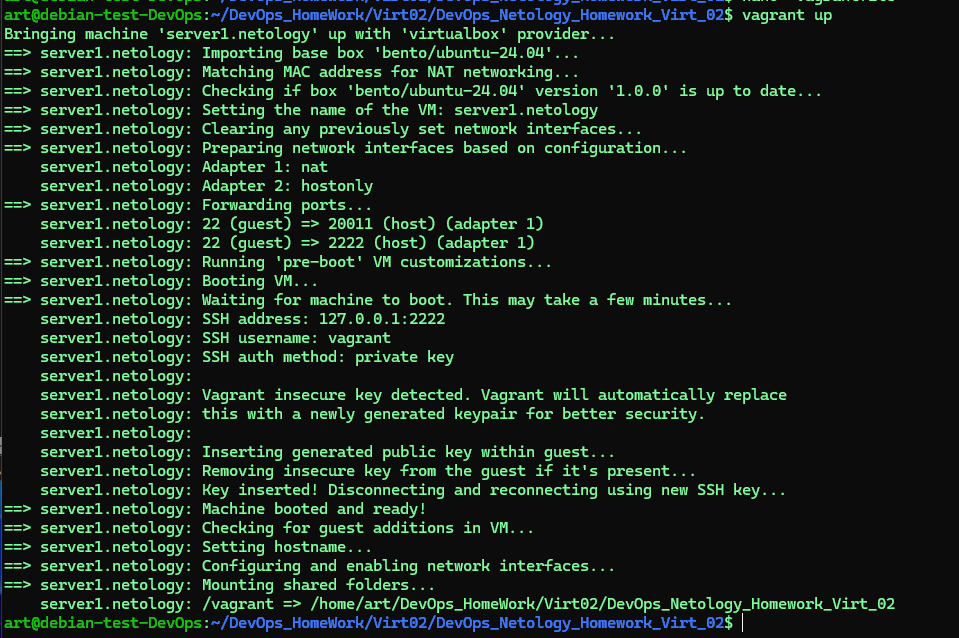

```vagrant status```
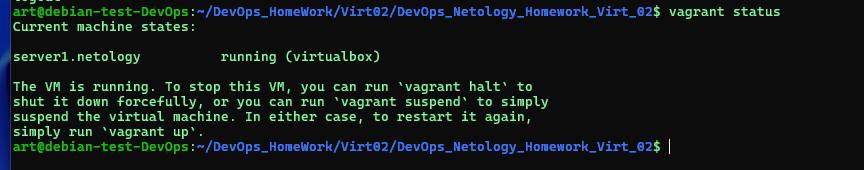
```
vagrant ssh
```
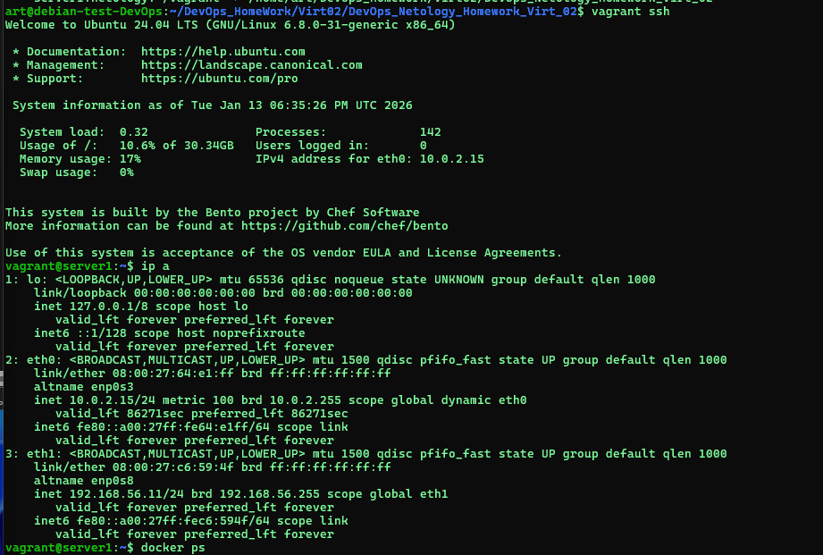
```cat /etc/*release```
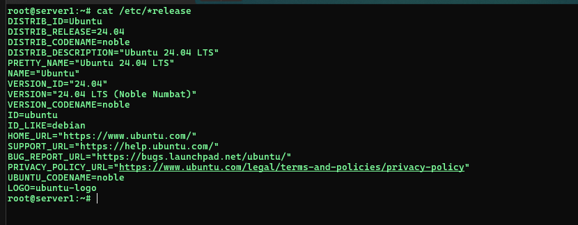
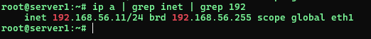

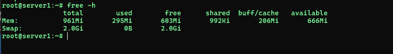
### Выключение ВМ. В директории, где находится Vagrantfile
```vagrant halt```
### Проверяем состояние ВМ. В директории, где находится Vagrantfile
``vagrant status``

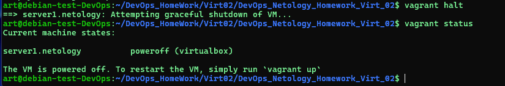
### Удаляем ВМ. В директории, где находится Vagrantfile
``vagrant destroy``
### Снова проверяем состояние ВМ. В директории, где находится Vagrantfile
``vagrant status``

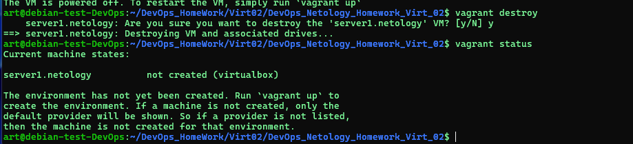